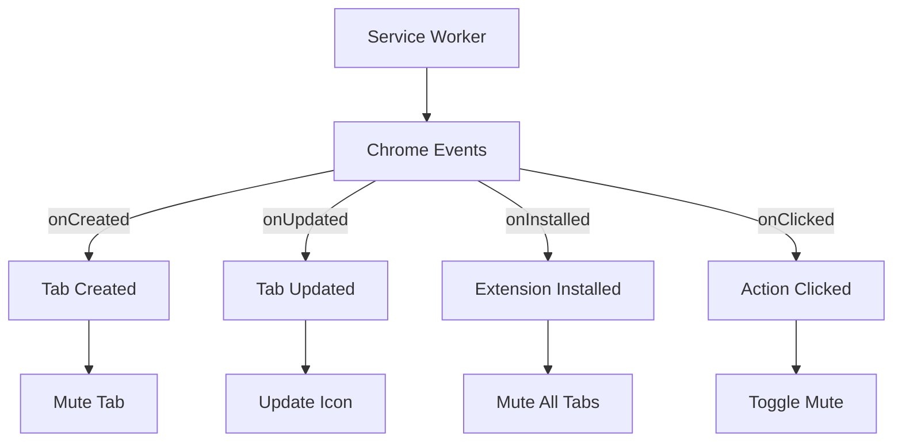
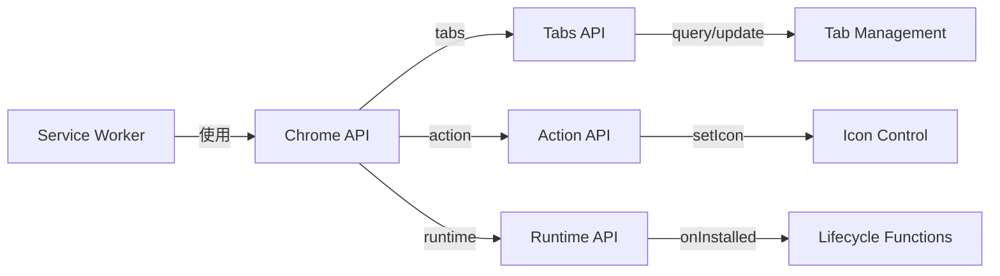

# システムパターン: Chrome拡張機能「静寂（Silent Tab）」

## アーキテクチャ概要

「静寂」拡張機能は、Chrome拡張機能のManifest V3仕様に基づいて構築されています。シンプルなアーキテクチャを採用し、主にバックグラウンドで動作するサービスワーカーを中心に設計されています。

## 主要コンポーネント

### 1. サービスワーカー (service_worker.js)
拡張機能のコア機能を提供するバックグラウンドスクリプトです。以下の責務を持ちます：
- タブのミュート状態の管理
- イベントリスナーの設定と処理
- アイコン状態の更新

### 2. マニフェスト (manifest.json)
拡張機能の設定と権限を定義します：
- 基本情報（名前、説明、バージョン）
- アイコンの定義
- 必要な権限
- 多言語サポート

### 3. 多言語サポート (_locales/)
- 英語 (en) と日本語 (ja) のメッセージを定義
- 拡張機能の名前と説明の翻訳を提供

## 設計パターン

### イベント駆動アーキテクチャ
Chrome拡張機能APIのイベントに基づいて動作します：
- `chrome.tabs.onCreated`: 新しいタブが作成されたとき
- `chrome.tabs.onUpdated`: タブの状態が更新されたとき
- `chrome.runtime.onInstalled`: 拡張機能がインストールまたは更新されたとき
- `chrome.action.onClicked`: 拡張機能のアイコンがクリックされたとき

### 非同期処理パターン
Chrome APIの非同期性を考慮し、Promise/async-awaitパターンを採用しています：
- エラーハンドリングのためのtry-catchブロック
- 非同期操作の適切な待機

### 状態管理
タブのミュート状態に基づいてUIを更新する単純な状態管理：
- タブのミュート状態に応じたアイコンの切り替え
- 状態変更時の適切なフィードバック

## コンポーネント間の関係

## エラーハンドリング戦略
- 各操作でのtry-catchブロックによる例外捕捉
- エラーログの出力（デバッグモード時のみ詳細ログ）
- 障害が発生しても拡張機能全体が停止しない堅牢な設計

## パフォーマンス最適化
- 最小限のリソース使用
- 効率的なイベントハンドリング
- 条件付きデバッグログ（本番環境では無効化）

## セキュリティ考慮事項
- 最小権限の原則に従い、必要最小限の権限のみを要求
- ユーザーデータへのアクセスなし
- 外部通信を行わないシンプルな設計

## 拡張性
将来の機能拡張を考慮した設計：
- モジュール化されたコード構造
- 明確に定義された責務
- 設定オプションの追加が容易な設計
